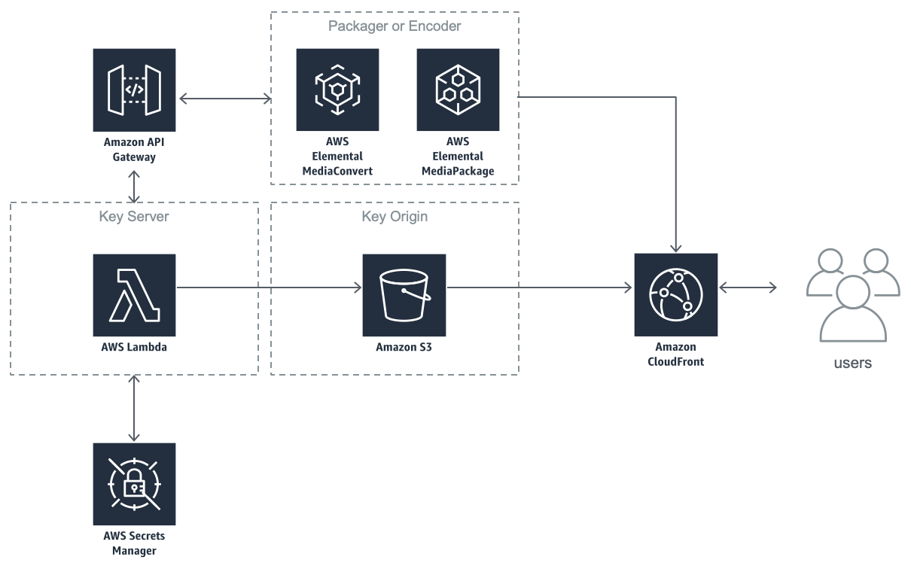

## SPEKE Reference Server

Secure Packager and Encoder Key Exchange (SPEKE) is part of the AWS Elemental content encryption protection strategy for media services customers. SPEKE defines the standard for communication between AWS Media Services and digital rights management (DRM) system key servers. SPEKE is used to supply keys to encrypt video on demand (VOD) content through AWS Elemental MediaConvert and for live content through AWS Elemental MediaPackage.

Take a look at [high-level SPEKE documentation](https://docs.aws.amazon.com/speke/latest/documentation/what-is-speke.html) available on the AWS web site.

## Setup

Use the provided CloudFormation template to deploy the reference key server into your AWS account. The reference SPEKE implementation provides a key server and key distribution cache for end-to-end segment encyption with HLS and DASH. Use it as an example and starting point when implementing a complete DRM solution with SPEKE.

The CloudFormation template creates an API Gateway, Lambda function, S3 bucket and CloudFront distribution and adds the needed settings for the reference server. Additionally, the template creates IAM policies and roles necessary for API Gateway, Lambda, Secrets Manager, S3 and CloudFront to interact.

The following diagram shows the primary components of the serverless SPEKE solution and the connectivity among the components during runtime. The diagram also shows one possible integration between AWS MediaPackage or AWS MediaConvert and SPEKE.

These sections will guide you through installation, testing and configuration of the SPEKE Reference Server.

1. [**Installation**](#speke-reference-server-installation) - This section includes installation instructions for API Gateway, Lambda deployment and AWS Elemental MediaPackage channel integration.

2. [**Test Cases**](tests/README.md) - This page include several unit tests and manual test cases that can be used to verify operation of the SPEKE Reference Server. These test cases do not require integration with additional services.

3. [**AWS Elemental MediaPackage**](MEDIAPACKAGE_CONFIG.md) - This page documents steps that can be used to verify operation of the SPEKE Reference Server using AWS Elemental MediaPackage.

4. [**Contributing**](CONTRIBUTING.md) - This page includes the guidelines for contributing your enhancements, fixes and documentation to the project.

5. [**Code of Conduct**](CODE_OF_CONDUCT.md) - This is what we expect from all people interacting and contributing with the team.

## SPEKE Reference Server Installation

The following page guides the user through deployment and configuration of the SPEKE Reference Server.

### Prerequisites

- An AWS account with administrator rights and access to the AWS console
- Note that this solution can be deployed to any region that supports API Gateway, Lambda, and S3. You need to consider the packager or encoder's location relative to the API Gateway endpoint used to create encryption keys. The encoder, packager and SPEKE services should be in the same region or as geographically close as possible to reduce the request/response latency in key generation.

### Building Cloudformation template and Lambda locally

1. Create a virtual environment for this project using python3 using steps outlined [here](https://docs.python.org/3/tutorial/venv.html).
1. Install dependencies within the virtual environment using `pip3 install -r requirements.txt`.
1. In `zappa_settings.json` under `src`, replace `aws_region` with the region this lambda will be deployed.
1. Run `local_build.sh`.
1. The script will generate required artifacts under `build` folder.
1. Create a new bucket in S3 (For example: `speke-us-east-1`). Create a folder called `speke` and upload the generated `speke-reference` lambda zip file.
1. In the generated `speke_reference.json`, replace `rodeolabz` with the name of your created bucket (`speke` is used in this example).
1. Use the `speke_reference.json` template in CloudFormation to deploy the speke reference server following the instructions below.

#### **Sidenote:** Building the lambda on Mac/Windows
AWS Lambda environment is similar to Amazon Linux (AL2) and so a dependency that this reference server needs: `cffi` does not match the lambda runtime when built on a Windows/ macOS machine. When the reference server is run, it might result in an error: `No module named '_cffi_backend'`. To resolve this, create a `requirements.txt` file with `cffi==<version>`, replacing version with the desired version number (The requirements.txt file can be used for a compatible version) and create a lambda layer following the steps outlined [here](https://aws.amazon.com/premiumsupport/knowledge-center/lambda-layer-simulated-docker/) and then update the speke reference lambda function to reference this layer.

### Deploy using CloudFormation template

1. Sign in to the AWS console.
1. Choose a region such as us-east-1 or us-west-2 to start.
1. Navigate to the AWS CloudFormation console.
1. Create a new stack.
1. On the `Select Template` page, select `Upload a template file` and choose the generated `speke_reference.json` file prepared in the above section.
1. At the `Specify Details` pages, provide a stack name, like `SPEKE`.
1. Provide a value for the `KeyRetentionDays` parameter. This is the amount of time to retain a key in the S3 bucket for client playback. Keys older than this amount will be automatically removed by S3. The default is 2 days, which is usually enough for live content across multiple time zones.
1. The `Options` page does not require any input, although you can choose to be notified after the template completes.

When the template is complete you will have an operational reference SPEKE server that can be used for HLS encryption. You can review the Resources tab of the template to see what was created or updated, and the Outputs tab for the URL of the SPEKE server  and the role ARN that permits MediaPackage access.

### Limitations

This solution only supports key creation for the following DRM technologies: Widevine, Playready

This solution will send a blank CPIX response if the Apple Fairplay system ID is used.

For Speke V2.0, this solution works for Widevine, Playready and Fairplay
Due to limitations on size of environment variables provided for a lambda, users must implement their own solution to create and send PSSH, ContentProtectionData and HLSSignalingData for the different DRM systems.

This solution only supports the contentProtection method to handle communication between the reference server solution and the Media Services. 
Users must implement copyProtectionData methods in order to handle client/player request to decrypt content.

