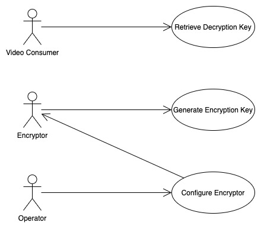
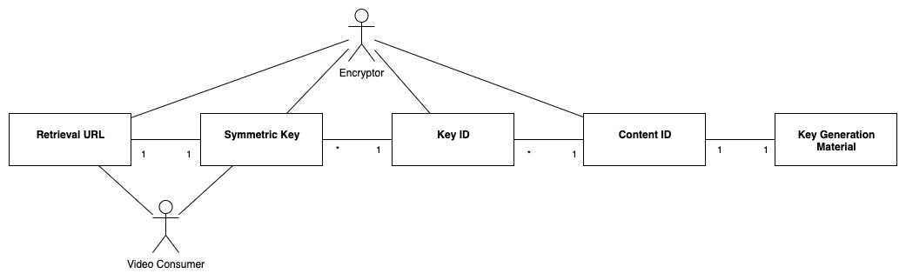
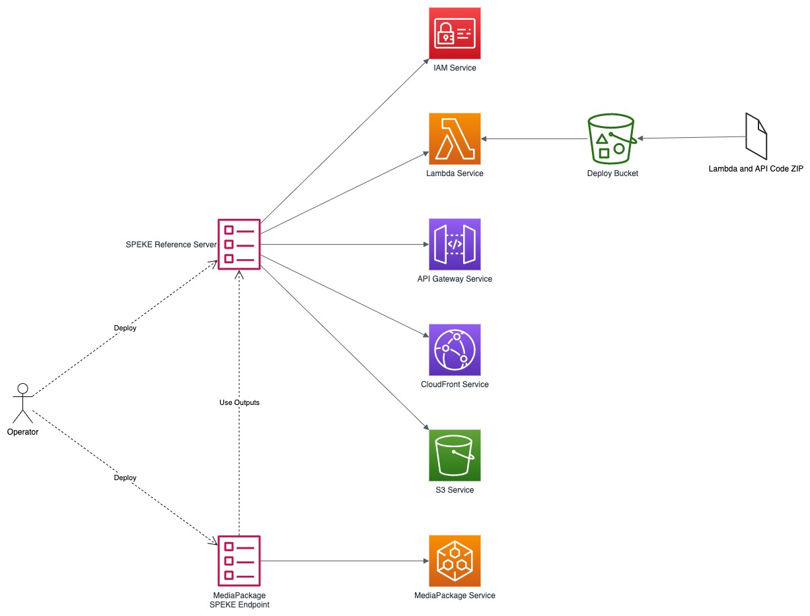
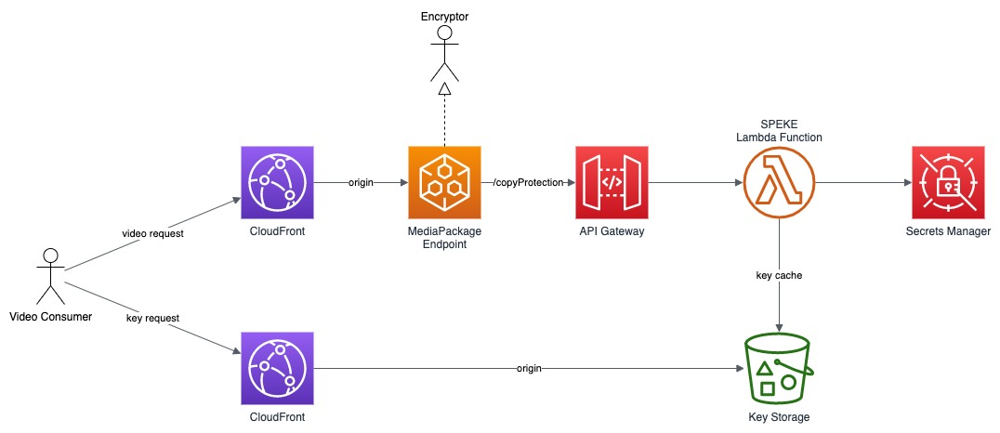
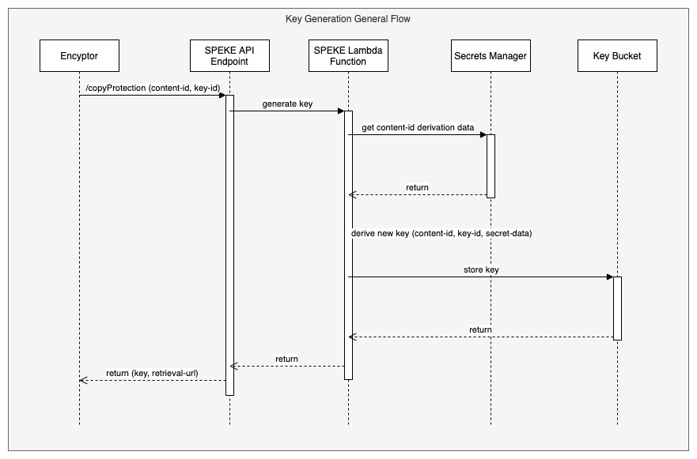
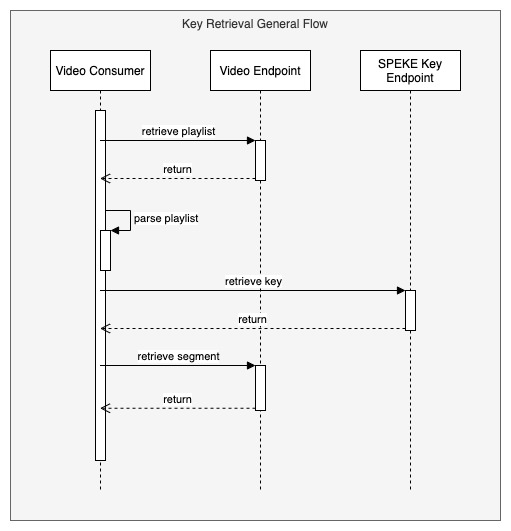

# SPEKE Server Architecture Views

## Views

This document describes the architectural views for the open source SPEKE Reference Server.

The views used in this document are:

1. use case view
2. logical view (E-R, types)
3. deployment view (deployment artifacts to services)
4. physical view (deployed code, configured services, communication paths)
5. behavioral views (sequence diagrams)

### Use Case View

#### Actors and Use Cases

**Actor: Encryptor**

*Use Case: Generate Encryption Key*

1. The actor sends a request that includes the content ID and key ID
2. The server determines if key generation material for the content ID exists
   1. If not, random key generation material is created and stored in Secrets Manager under the content ID
   2. If so, the key generation material is retrieved
3. The new key is generated and stored
5. The new key, content ID and key ID is included in the response to the actor

**Actor: Video Consumer**

*Use Case: Retrieve Decryption Key*

1. The player retrieves the current version of a playlist
2. The player parses the playlist to determine the next key to retrieve
3. The player requests the key data from the key URL in the playlist
4. The server returns the key data to the player

**Actor: Operator**

*Use Case: Configure Encryptor*

### Logical View

The elements in this view represent the types (and terminology) of the problem space.

#### Retrieval URL

This type represents a unique URL used to retrieve a specific key. 

#### Symmetric Key

This type represents a block of data used to encrypt and decrypt segments of video.

#### Key ID

This type represents a unique index value for a key within a content ID.

#### Content ID

This type represents a live stream or video on demand playback.

#### Key Generation Material

This type represents a block of data known only to the SPEKE server and related to a specific content ID. This data is used with other information provided by the encryptor to generate new keys.

### Deployment View

The deployment view shows the relationships between the deployment units (installers, binaries, CloudFormation templates) and the target services that receive the deployment configuration or run deployed code. 

The above diagram shows the SPEKE server template used to install IAM resources, Lambda code, and configure API Gateway, CloudFront and S3. The Lambda deployment archive is hosted on several buckets in different regions to simplify installation for end users.

An optional template is provided to quickly configure a encrypted MediaPackage origin endpoint. This template uses outputs from the SPEKE stack and a MediaPackage channel name to create a new endpoint.

### Physical View

The physical view shows the deployed software with configured cloud resources and control and data connections among them.

This preceeding diagram shows the resources that participate in the encryption and decryption process of SPEKE with MediaPackage. The SPEKE server Lambda function receives requests from MediaPackage through API Gateway for encryption keys. MediaPackage builds the playlist and encrypted video segments and provides them through one CloudFront distribution. The playlist entries for decryption keys include a URL to retrieve each key through the second CloudFront distribution.

### Behavioral Views

The following sequence diagram represents the process for requesting a new key, generating it, storing it and returning it to the Encryptor for use.

The following sequence diagram represents the process for requesting and using key data retrieved from the URL specified in the video playlist.

