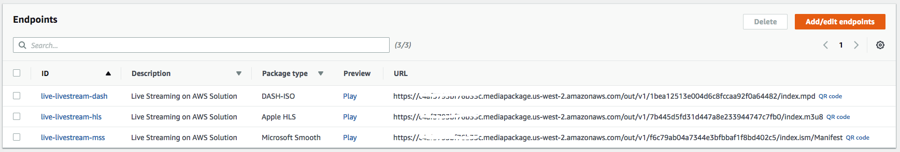
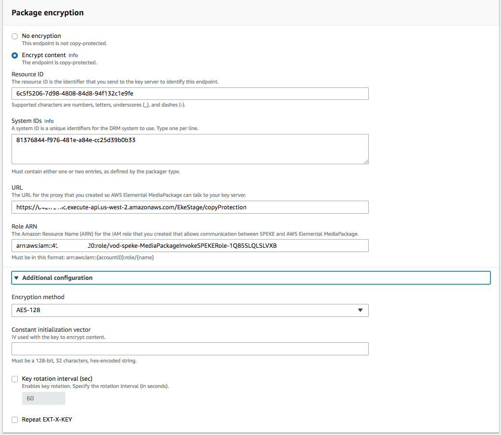
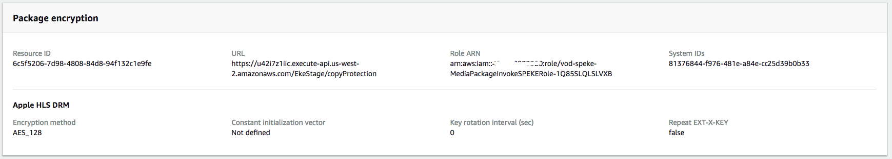
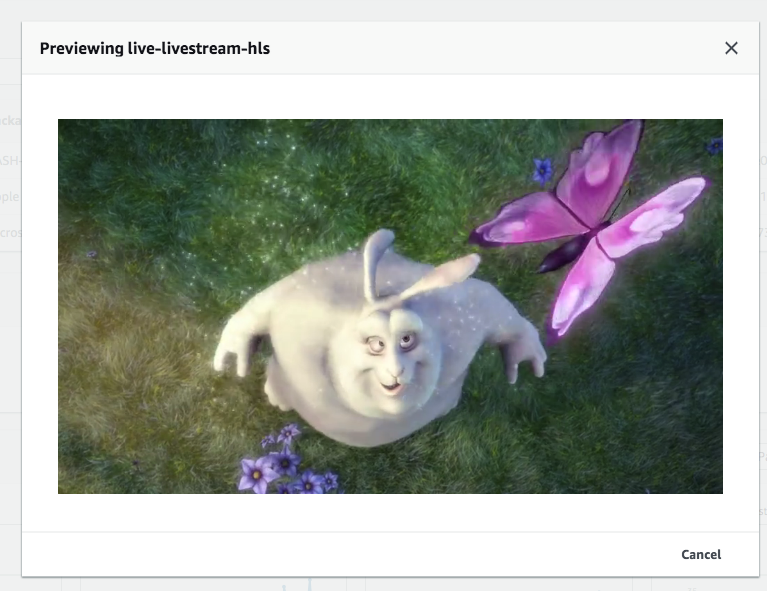

# Module: Digital Rights Management (DRM) and Encryption

When working with videos for your service or Over the Top (OTT) platform, you will very likely need to secure and protect your live streams prior to delivering content to your end users. Approaches for securing content include basic content _encryption_ or by applying highly secure Digital Rights Management (DRM) to the content. Examples of DRM include Fairplay, Widevine and PlayReady.

In this module, you'll use AWS Elemental MediaPackage, to secure and encrypt your live channels. You'll learn about the Secure Packager and Encoder Key Exchange (SPEKE) API, deploy an AWS SPEKE reference server, and configure AWS Elemental MediaPackage to encrypt HLS  content using AES-128 encryption.

## Prerequisites
You'll need to have previously installed the Live Streaming Solution

You'll need to have previously deployed the AWS SPEKE Reference Server.<br/>
https://github.com/awslabs/speke-reference-server

Once you've installed the AWS SPEKE Reference Server retrieve the SPEKE API URL and MediaPackage Role from the output of your Cloudformation Stack Details. 

Goto CloudFormation-> Stacks -> **AWS SPEKE Reference Server Stack Name** -> Outputs
and make a  note of the below paramters

| Parameter | Example  |
|--------------------------|-------------------------------------------------------------------------------------------|
| SPEKEServerURL |``` https://{hostname}.execute-api.eu-west-1.amazonaws.com/EkeStage/copyProtection ``` |
| MediaPackageSPEKERoleArn|``` arn:aws:iam::{AWS_ACCOUNT}:role/speke-reference-MediaPackageInvokeSPEKERole-{INSTANCE_ID} ``` |

Next, Goto CloudFormation -> **Live Streaming Solution Stack** -> Outputs and make a note of the parameters below.

| Parameter |  |
|--------------------------|-------------------------------------------------------------------------------------------|
| DemoConsole |``` https://{host}.cloudfront.net/index.html ``` |

**Make sure you replace the various values such as hostname, aws_account with your own deployment vaues**

### API Gateway

#### Server Test

1. Navigate to the AWS API Gateway Console
1. Select the region deployed with the SPEKE Reference Server
1. Select the SPEKEReferenceAPI
1. Select the POST method on the /copyProtection resource
1. Click the Test link on the left side of the main compartment
1. Copy the following into the Request Body compartment
```
<?xml version="1.0" encoding="UTF-8"?>
<cpix:CPIX id="5E99137A-BD6C-4ECC-A24D-A3EE04B4E011" 
    xmlns:cpix="urn:dashif:org:cpix" 
    xmlns:pskc="urn:ietf:params:xml:ns:keyprov:pskc" 
    xmlns:speke="urn:aws:amazon:com:speke">
    <cpix:ContentKeyList>
        <cpix:ContentKey kid="6c5f5206-7d98-4808-84d8-94f132c1e9fe"></cpix:ContentKey>
    </cpix:ContentKeyList>
    <cpix:DRMSystemList>
        <cpix:DRMSystem kid="6c5f5206-7d98-4808-84d8-94f132c1e9fe" systemId="81376844-f976-481e-a84e-cc25d39b0b33">
            <cpix:ContentProtectionData />
            <speke:KeyFormat />
            <speke:KeyFormatVersions />
            <speke:ProtectionHeader />
            <cpix:PSSH />
            <cpix:URIExtXKey />
        </cpix:DRMSystem>
    </cpix:DRMSystemList>
    <cpix:ContentKeyPeriodList>
        <cpix:ContentKeyPeriod id="keyPeriod_e64248f6-f307-4b99-aa67-b35a78253622" index="11425"/>
    </cpix:ContentKeyPeriodList>
    <cpix:ContentKeyUsageRuleList>
        <cpix:ContentKeyUsageRule kid="6c5f5206-7d98-4808-84d8-94f132c1e9fe">
            <cpix:KeyPeriodFilter periodId="keyPeriod_e64248f6-f307-4b99-aa67-b35a78253622"/>
        </cpix:ContentKeyUsageRule>
    </cpix:ContentKeyUsageRuleList>
</cpix:CPIX>
```
7. Click the Test button
8. Confirm that you have a similar response returned by the API request.
```
<cpix:CPIX xmlns:cpix="urn:dashif:org:cpix" xmlns:pskc="urn:ietf:params:xml:ns:keyprov:pskc" xmlns:speke="urn:aws:amazon:com:speke" id="5E99137A-BD6C-4ECC-A24D-A3EE04B4E011">
    <cpix:ContentKeyList>
        <cpix:ContentKey kid="6c5f5206-7d98-4808-84d8-94f132c1e9fe"><cpix:Data><pskc:Secret><pskc:PlainValue>ALzP1aOTJvzfqg9I12k2Vw==</pskc:PlainValue></pskc:Secret></cpix:Data></cpix:ContentKey>
    </cpix:ContentKeyList>
    <cpix:DRMSystemList>
        <cpix:DRMSystem kid="6c5f5206-7d98-4808-84d8-94f132c1e9fe" systemId="81376844-f976-481e-a84e-cc25d39b0b33">
            <speke:KeyFormat />
            <speke:KeyFormatVersions />
            <cpix:URIExtXKey>aHR0cHM6Ly9kMnVod2Jqc3p1ejF2Ny5jbG91ZGZyb250Lm5ldC81RTk5MTM3QS1CRDZDLTRFQ0MtQTI0RC1BM0VFMDRCNEUwMTEvNmM1ZjUyMDYtN2Q5OC00ODA4LTg0ZDgtOTRmMTMyYzFlOWZl</cpix:URIExtXKey>
        </cpix:DRMSystem>
    </cpix:DRMSystemList>
    <cpix:ContentKeyPeriodList>
        <cpix:ContentKeyPeriod id="keyPeriod_e64248f6-f307-4b99-aa67-b35a78253622" index="11425" />
    </cpix:ContentKeyPeriodList>
    <cpix:ContentKeyUsageRuleList>
        <cpix:ContentKeyUsageRule kid="6c5f5206-7d98-4808-84d8-94f132c1e9fe">
            <cpix:KeyPeriodFilter periodId="keyPeriod_e64248f6-f307-4b99-aa67-b35a78253622" />
        </cpix:ContentKeyUsageRule>
    </cpix:ContentKeyUsageRuleList>
</cpix:CPIX>
```
## 2. Configuring DRM on a MediaPackage EndPoint

1. Login to the AWS Console
1. Navigate to *MediaPackage*
1. Select the **reinvent-live-livestream** channel
1. Scroll down to *Endpoints* section of the channel detals



5. Select the **reinvent-live-livestream-hls** endpoint and *edit* the endpoint
1. Scroll down to the *Package encryption* section of the endpoint details
1. Select the **Encrypt Content** radio button
1. Fill in the following encryption details
ResourceID : ```6c5f5206-7d98-4808-84d8-94f132c1e9fe``` <br>
DRM System ID :  ```81376844-f976-481e-a84e-cc25d39b0b33``` <br>
URL : ``` { SPEKEServerURL }``` <br>
MediaPackage Role : ```{MediaPackage Role from the Stack Output }```
1. Expand the *additional configuration*  
1. Select `AES 128` for the Encryption method.


11. Click on **Save** to update your changes.

## 3. Play the videos



You can play the AES-128 encrypted HLS endpoint  using:

* Open up the URL from the **DemoConsole** outlined in the Live Solution Stack.
* Click on the **Preview** for the **HLS** Endpoint




## Completion

Congratulations!  You have successfully created an encrypted live stream using  AWS Elemental MediaPackage. 


