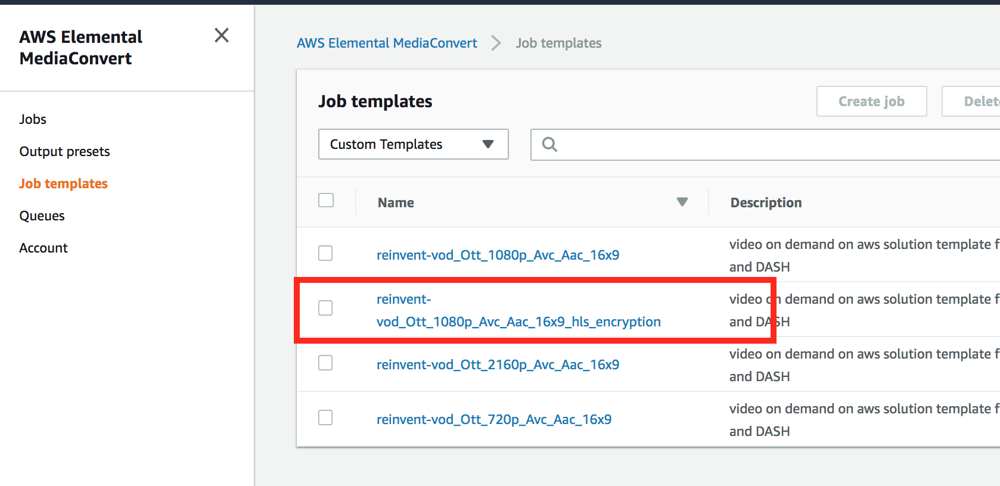
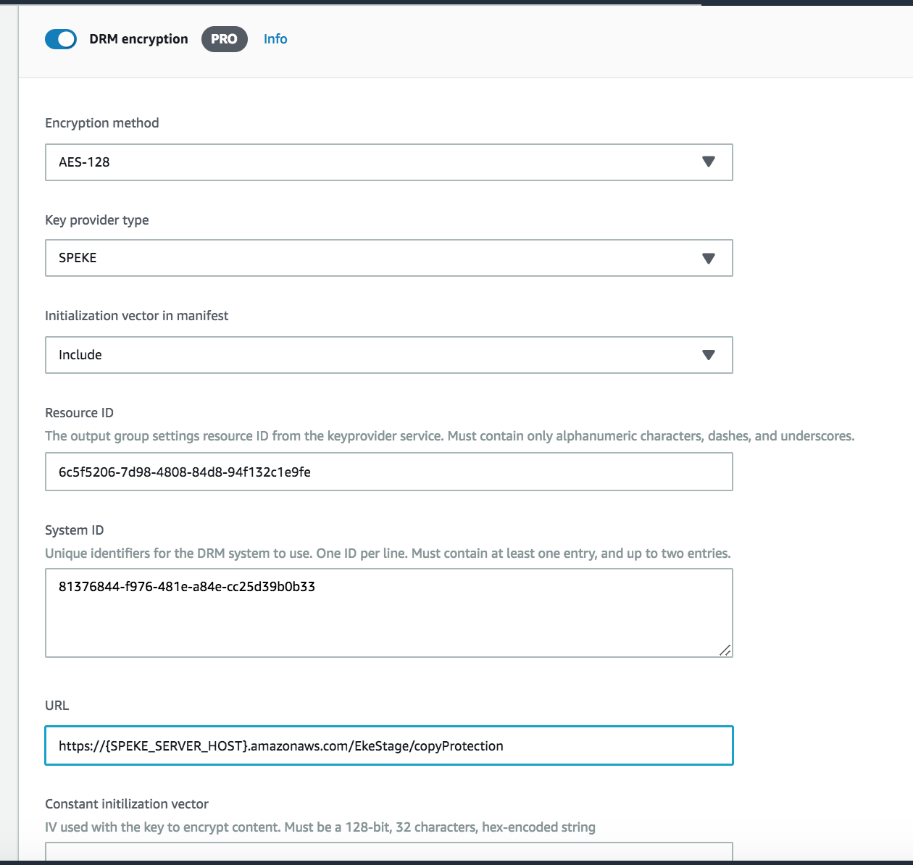
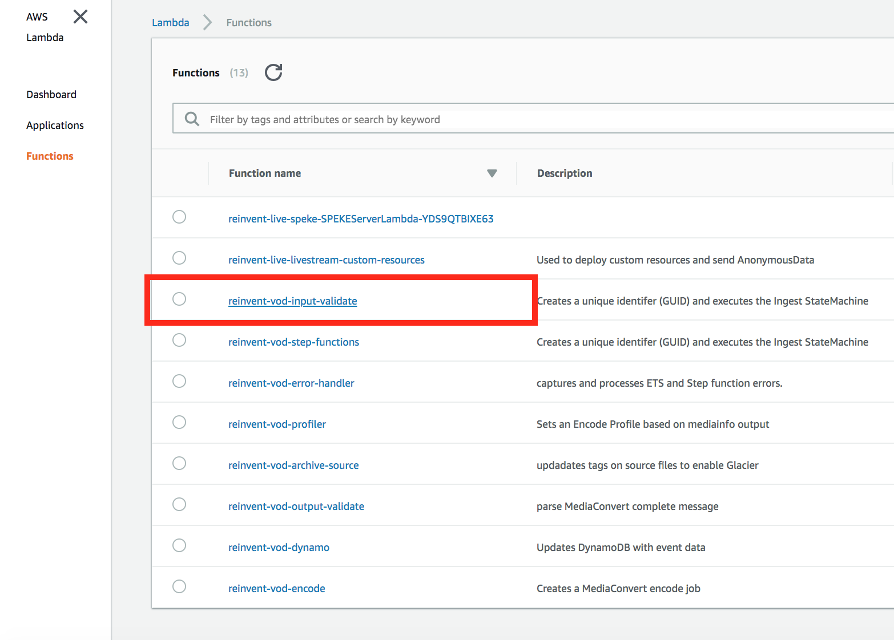
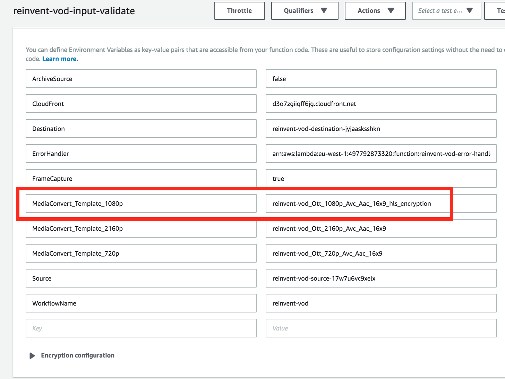

# Module: Digital Rights Management (DRM) and Encryption

When working with videos for your service or Over the Top (OTT) platform, you will very likely need to secure and protect your content prior to delivering videos to your end users. Approaches for securing content include basic content _encryption_ or by applying highly secure Digital Rights Management (DRM) to the content. Examples of DRM include Fairplay, Widevine and PlayReady.

In this module, you'll use AWS Elemental MediaConvert, a file-based video transcoding service to secure and encrypt your videos. You'll learn about the Secure Packager and Encoder Key Exchange (SPEKE) API, deploy an AWS SPEKE reference server, and configure AWS Elemental MediaConvert to encrypt HLS packaged content using AES-128 encryption.

## Prerequisites
You'll need to have previously deployed the AWS SPEKE Reference Server.<br/>
https://github.com/awslabs/speke-reference-server

Goto CloudFormation-> Stacks -> **AWS SPEKE Reference Server Stack Name** -> Outputs
and make a  note of the below parameters

| Parameter | Example  |
|--------------------------|-------------------------------------------------------------------------------------------|
| SPEKEServerURL |``` https://{HOST}.execute-api.eu-west-1.amazonaws.com/EkeStage/copyProtection ``` |


## 1. Testing the SPEKE API...

### API Gateway

#### Server Test

1. Navigate to the AWS API Gateway Console
1. Select the region deployed with the SPEKE Reference Server
1. Select the SPEKEReferenceAPI
1. Select the POST method on the /copyProtection resource
1. Click the Test link on the left side of the main compartment
1. Copy the following into the Request Body compartment
```
<?xml version="1.0" encoding="UTF-8"?>
<cpix:CPIX id="5E99137A-BD6C-4ECC-A24D-A3EE04B4E011" 
    xmlns:cpix="urn:dashif:org:cpix" 
    xmlns:pskc="urn:ietf:params:xml:ns:keyprov:pskc" 
    xmlns:speke="urn:aws:amazon:com:speke">
    <cpix:ContentKeyList>
        <cpix:ContentKey kid="6c5f5206-7d98-4808-84d8-94f132c1e9fe"></cpix:ContentKey>
    </cpix:ContentKeyList>
    <cpix:DRMSystemList>
        <cpix:DRMSystem kid="6c5f5206-7d98-4808-84d8-94f132c1e9fe" systemId="81376844-f976-481e-a84e-cc25d39b0b33">
            <cpix:ContentProtectionData />
            <speke:KeyFormat />
            <speke:KeyFormatVersions />
            <speke:ProtectionHeader />
            <cpix:PSSH />
            <cpix:URIExtXKey />
        </cpix:DRMSystem>
    </cpix:DRMSystemList>
    <cpix:ContentKeyPeriodList>
        <cpix:ContentKeyPeriod id="keyPeriod_e64248f6-f307-4b99-aa67-b35a78253622" index="11425"/>
    </cpix:ContentKeyPeriodList>
    <cpix:ContentKeyUsageRuleList>
        <cpix:ContentKeyUsageRule kid="6c5f5206-7d98-4808-84d8-94f132c1e9fe">
            <cpix:KeyPeriodFilter periodId="keyPeriod_e64248f6-f307-4b99-aa67-b35a78253622"/>
        </cpix:ContentKeyUsageRule>
    </cpix:ContentKeyUsageRuleList>
</cpix:CPIX>
```
6. Click the Test button
7. Confirm that you have a similar response returned by the API request.
```
<cpix:CPIX xmlns:cpix="urn:dashif:org:cpix" xmlns:pskc="urn:ietf:params:xml:ns:keyprov:pskc" xmlns:speke="urn:aws:amazon:com:speke" id="5E99137A-BD6C-4ECC-A24D-A3EE04B4E011">
    <cpix:ContentKeyList>
        <cpix:ContentKey kid="6c5f5206-7d98-4808-84d8-94f132c1e9fe"><cpix:Data><pskc:Secret><pskc:PlainValue>ALzP1aOTJvzfqg9I12k2Vw==</pskc:PlainValue></pskc:Secret></cpix:Data></cpix:ContentKey>
    </cpix:ContentKeyList>
    <cpix:DRMSystemList>
        <cpix:DRMSystem kid="6c5f5206-7d98-4808-84d8-94f132c1e9fe" systemId="81376844-f976-481e-a84e-cc25d39b0b33">
            <speke:KeyFormat />
            <speke:KeyFormatVersions />
            <cpix:URIExtXKey>aHR0cHM6Ly9kMnVod2Jqc3p1ejF2Ny5jbG91ZGZyb250Lm5ldC81RTk5MTM3QS1CRDZDLTRFQ0MtQTI0RC1BM0VFMDRCNEUwMTEvNmM1ZjUyMDYtN2Q5OC00ODA4LTg0ZDgtOTRmMTMyYzFlOWZl</cpix:URIExtXKey>
        </cpix:DRMSystem>
    </cpix:DRMSystemList>
    <cpix:ContentKeyPeriodList>
        <cpix:ContentKeyPeriod id="keyPeriod_e64248f6-f307-4b99-aa67-b35a78253622" index="11425" />
    </cpix:ContentKeyPeriodList>
    <cpix:ContentKeyUsageRuleList>
        <cpix:ContentKeyUsageRule kid="6c5f5206-7d98-4808-84d8-94f132c1e9fe">
            <cpix:KeyPeriodFilter periodId="keyPeriod_e64248f6-f307-4b99-aa67-b35a78253622" />
        </cpix:ContentKeyUsageRule>
    </cpix:ContentKeyUsageRuleList>
</cpix:CPIX>
```
## 2. Configuring DRM for a MediaConvert Job

A  MediaConvert Output group setting lets you configure the DRM parameters required to encrypt a video for that  job. Please note : that you can currently  have one package format e.g HLS or DASH configured per Job Template. In addition you can have upto 2 DRM(s) applied to an output group. For example DASH allows for Widevine and PlayReady DRM to be used for a single video.

In this module, you will edit an existing MediaConvert Job Template and update it to encrypt your video using AES-128 encryption using the AWS Speke Reference Server.

### Detailed Instructions

#### Job Templates section

1. Open the MediaConvert console for the region you are completing the lab in (eu-west-1 Ireland).<br/> https://eu-west-1.console.aws.amazon.com/mediaconvert
1. Select **Job templates** from the side bar menu. 
1. Select **Custom Templates** from the dropdown menu



4. Select `{stack}_Ott_1080p_Avc_Aac_16x9_hls_encryption` to open the Jobs templates details page.
1. Click on **Update** to edit the Template
1. Select the 'Apple HLS ' Output Group underneath the Output group Panel  
1. Turn on **DRM encryption**


8. Select `AES 128` for the Encryption method.
1. Select `SPEKE` as the Key provider type.
1. Enter this for ResourceID 
```
6c5f5206-7d98-4808-84d8-94f132c1e9fe
```
1. Enter this DRM System ID for AES-128
```
81376844-f976-481e-a84e-cc25d39b0b33
```

12. Enter your SPEKE Reference Server API as the URL. ( Replace the Hostname )
```
https://{host}.execute-api.eu-west-1.amazonaws.com/EkeStage/copyProtection
```



13. Click on **Update** at the bottom of the page to save the Job template. 

## 3. Resubmit / Reprocess the Video Asset with Encryption


### Update Lambda to use the Encryption Template
1. In the AWS Management Console, navigate to AWS Lambda



1. Select the ```{stackname}-input-validate``` function and scroll down to the enviornment variable
1. Look for the ```MediaConvert_Template_1080p``` parameter and replace it with **{stackname}_Ott_1080p_Avc_Aac_16x9_hls_encryption**
1. Click on the **Save** Button



### Trigger Workflow by renaming source asset. 
1. In the AWS Management Console choose **Services** then select **S3** under Storage.
1. Select the bucket where your source input files are located ```{stack}-source```
1. Rename the source asset ```van_life.mp4 ``` to ```van_life_1.mp4``` by right clicking the on the filename
1. This should trigger an asset workflow and the encrypted files will be output to a folder 

  
## 4. Confirm MediaConvert Job Completion 

1. In the AWS Management Console choose **AWS MediaConvert** then select **Jobs** from the righthand menu
1. You should see a newly submitted  MediaConvert job in a PROGRESSING or COMPELTE state
1. Once your Job is complete you should now be able to playback the encoded assets.
1. Keep track of the MediaConvert Job ID which will be used to lookup the HLS Playback URL.

## 5. Play the videos

You should have received an email with a link to the HLS-128 encrypted asset upon completion of the workflow.

### Alternatively - Lookup the HLS URL from Amazon DynamoDB

1. In the AWS Management Console choose **Services** then select **DynamoDB** under Databases.
1. Select the {stack-name} Table and Choose Items
1. Find the GUID based looking up on the Elemental MediaConvert JobID under the **ecodeJobId** coloumn
1. Copy the corresponding **hlsURL** value


You can play the HLS streaming using:
* DemoConsole Player
    1. Go the landing page for the Video On Demand workshop
    1. Click on the Preview link to load the Video Player
    1. Paste and preview the HLS Url into the Cloudfront Url input box.
* or Open Safari on a Mac and paste the HLS URL into the browser.


## Completion

Congratulations!  You have successfully created an encrypted video asset using  AWS Elemental MediaConvert. 
