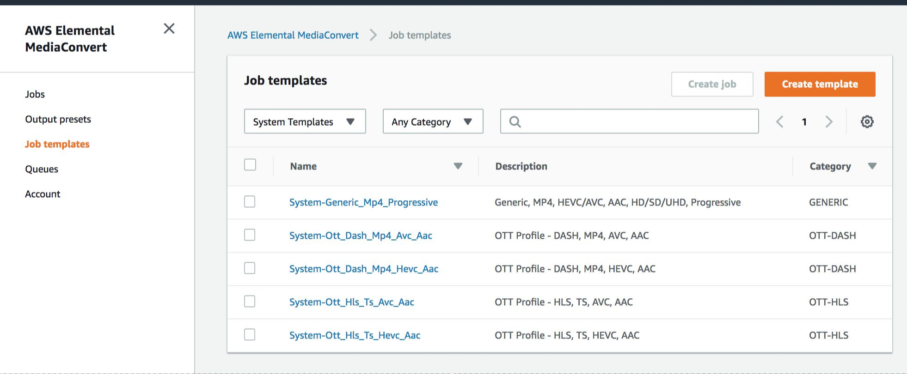
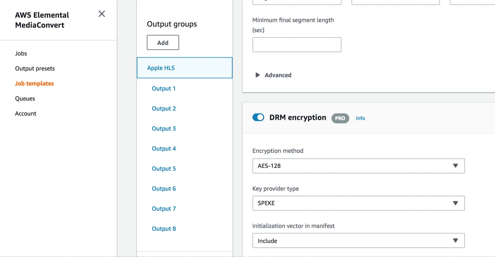
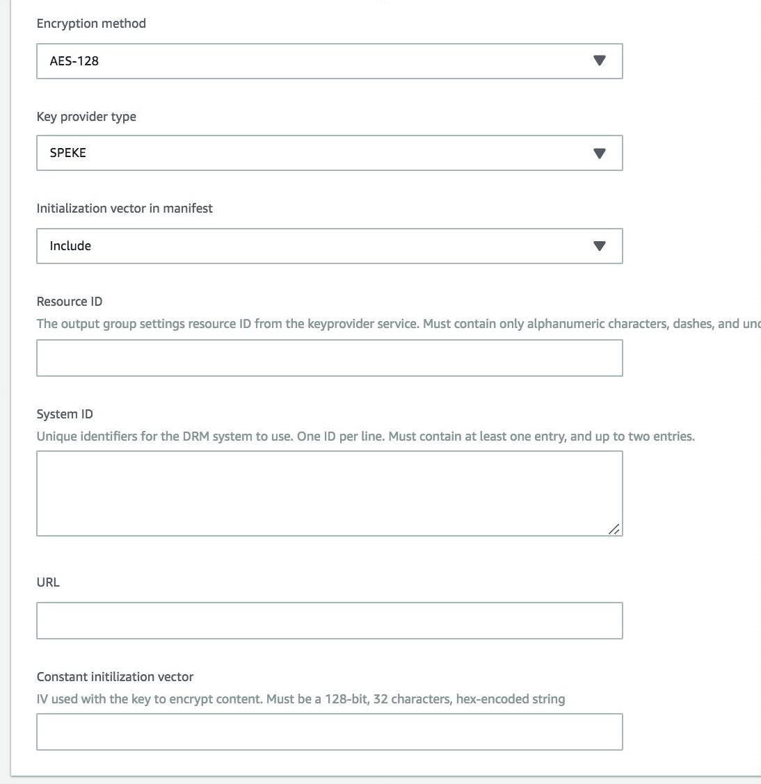

# Module: Digital Rights Management (DRM) and Encryption

When working with videos for your service or Over the Top (OTT) platform, you will very likely need to secure and protect your content prior to delivering videos to your end users. Approaches for securing content include basic content _encryption_ or by applying highly secure Digital Rights Management (DRM) to the content. Examples of DRM include Fairplay, Widevine and PlayReady.

In this module, you'll use AWS Elemental MediaConvert, a file-based video transcoding service to secure and encrypt your videos. You'll learn about the Secure Packager and Encoder Key Exchange (SPEKE) API, deploy an AWS SPEKE reference server, and configure AWS Elemental MediaConvert to encrypt HLS packaged content using AES-128 encryption.

## Prerequisites
You'll need to have previously deployed the AWS SPEKE Reference Server.<br/>
https://github.com/awslabs/speke-reference-server

Goto CloudFormation-> Stacks -> **AWS SPEKE Reference Server Stack Name** -> Outputs
and make a  note of the below paramters

| Parameter | Example  |
|--------------------------|-------------------------------------------------------------------------------------------|
| SPEKEServerURL |``` https://u42i7z1iic.execute-api.us-west-2.amazonaws.com/EkeStage/copyProtection ``` |
| MediaConvertSPEKERoleArn|``` arn:aws:iam::{AWS_ACCOUNT}:role/speke-reference-MediaPackageInvokeSPEKERole-{INSTANCE_ID} ``` |


## 1. Testing the SPEKE API...

### Lambdas

#### Server Test

1. Navigate to the AWS Lambda Console
1. Select the region deployed with the SPEKE Reference Server
1. Select the function that contains the name {STACKNAME}-SPEKEServerLambda-{}
1. Pull down the test events list at the top right
1. Choose Configure test events
1. Set the Saved Test Event name to ServerKeyRequest
1. Replace the **hostname** and Copy the following exactly into the text area for the event
```
{
  "resource": "/copyProtection",
  "path": "/copyProtection",
  "httpMethod": "POST",
  "headers": {
    "Accept": "*/*",
    "content-type": "application/xml",
    "Host": "u42i7z1iic.execute-api.us-west-2.amazonaws.com"
  },
  "requestContext": {
    "path": "/EkeStage/copyProtection",
    "stage": "EkeStage",
    "resourcePath": "/copyProtection",
    "httpMethod": "POST"
  },
  "body": "PD94bWwgdmVyc2lvbj0iMS4wIiBlbmNvZGluZz0iVVRGLTgiPz48Y3BpeDpDUElYIGlkPSI1RTk5MTM3QS1CRDZDLTRFQ0MtQTI0RC1BM0VFMDRCNEUwMTEiIHhtbG5zOmNwaXg9InVybjpkYXNoaWY6b3JnOmNwaXgiIHhtbG5zOnBza2M9InVybjppZXRmOnBhcmFtczp4bWw6bnM6a2V5cHJvdjpwc2tjIiB4bWxuczpzcGVrZT0idXJuOmF3czphbWF6b246Y29tOnNwZWtlIj48Y3BpeDpDb250ZW50S2V5TGlzdD48Y3BpeDpDb250ZW50S2V5IGtpZD0iNmM1ZjUyMDYtN2Q5OC00ODA4LTg0ZDgtOTRmMTMyYzFlOWZlIj48L2NwaXg6Q29udGVudEtleT48L2NwaXg6Q29udGVudEtleUxpc3Q+PGNwaXg6RFJNU3lzdGVtTGlzdD48Y3BpeDpEUk1TeXN0ZW0ga2lkPSI2YzVmNTIwNi03ZDk4LTQ4MDgtODRkOC05NGYxMzJjMWU5ZmUiIHN5c3RlbUlkPSI4MTM3Njg0NC1mOTc2LTQ4MWUtYTg0ZS1jYzI1ZDM5YjBiMzMiPiAgICA8Y3BpeDpDb250ZW50UHJvdGVjdGlvbkRhdGEgLz4gICAgPHNwZWtlOktleUZvcm1hdCAvPiAgICA8c3Bla2U6S2V5Rm9ybWF0VmVyc2lvbnMgLz4gICAgPHNwZWtlOlByb3RlY3Rpb25IZWFkZXIgLz4gICAgPGNwaXg6UFNTSCAvPiAgICA8Y3BpeDpVUklFeHRYS2V5IC8+PC9jcGl4OkRSTVN5c3RlbT48L2NwaXg6RFJNU3lzdGVtTGlzdD48Y3BpeDpDb250ZW50S2V5UGVyaW9kTGlzdD48Y3BpeDpDb250ZW50S2V5UGVyaW9kIGlkPSJrZXlQZXJpb2RfZTY0MjQ4ZjYtZjMwNy00Yjk5LWFhNjctYjM1YTc4MjUzNjIyIiBpbmRleD0iMTE0MjUiLz48L2NwaXg6Q29udGVudEtleVBlcmlvZExpc3Q+PGNwaXg6Q29udGVudEtleVVzYWdlUnVsZUxpc3Q+PGNwaXg6Q29udGVudEtleVVzYWdlUnVsZSBraWQ9IjZjNWY1MjA2LTdkOTgtNDgwOC04NGQ4LTk0ZjEzMmMxZTlmZSI+PGNwaXg6S2V5UGVyaW9kRmlsdGVyIHBlcmlvZElkPSJrZXlQZXJpb2RfZTY0MjQ4ZjYtZjMwNy00Yjk5LWFhNjctYjM1YTc4MjUzNjIyIi8+PC9jcGl4OkNvbnRlbnRLZXlVc2FnZVJ1bGU+PC9jcGl4OkNvbnRlbnRLZXlVc2FnZVJ1bGVMaXN0PjwvY3BpeDpDUElYPg==",
  "isBase64Encoded": true
}
```
8. Select the ServerKeyRequest saved test event
1. Click the Test button
1. Expand the details of the execution result
1. Find and verify the following XML data in the Log output compartment (formatted for readability); this data includes the encoded encryption key value and the key ID (kid)
```
<?xml version="1.0" encoding="UTF-8"?>
<cpix:CPIX xmlns:cpix="urn:dashif:org:cpix" xmlns:pskc="urn:ietf:params:xml:ns:keyprov:pskc" xmlns:speke="urn:aws:amazon:com:speke" id="5E99137A-BD6C-4ECC-A24D-A3EE04B4E011">
   <cpix:ContentKeyList>
      <cpix:ContentKey kid="6c5f5206-7d98-4808-84d8-94f132c1e9fe">
         <cpix:Data>
            <pskc:Secret>
               <pskc:PlainValue>ALzP1aOTJvzfqg9I12k2Vw==</pskc:PlainValue>
            </pskc:Secret>
         </cpix:Data>
      </cpix:ContentKey>
   </cpix:ContentKeyList>
   <cpix:DRMSystemList>
      <cpix:DRMSystem kid="6c5f5206-7d98-4808-84d8-94f132c1e9fe" systemId="81376844-f976-481e-a84e-cc25d39b0b33">
         <speke:KeyFormat />
         <speke:KeyFormatVersions />
         <cpix:URIExtXKey>aHR0cHM6Ly9kMnVod2Jqc3p1ejF2Ny5jbG91ZGZyb250Lm5ldC81RTk5MTM3QS1CRDZDLTRFQ0MtQTI0RC1BM0VFMDRCNEUwMTEvNmM1ZjUyMDYtN2Q5OC00ODA4LTg0ZDgtOTRmMTMyYzFlOWZl</cpix:URIExtXKey>
      </cpix:DRMSystem>
   </cpix:DRMSystemList>
   <cpix:ContentKeyPeriodList>
      <cpix:ContentKeyPeriod id="keyPeriod_e64248f6-f307-4b99-aa67-b35a78253622" index="11425" />
   </cpix:ContentKeyPeriodList>
   <cpix:ContentKeyUsageRuleList>
      <cpix:ContentKeyUsageRule kid="6c5f5206-7d98-4808-84d8-94f132c1e9fe">
         <cpix:KeyPeriodFilter periodId="keyPeriod_e64248f6-f307-4b99-aa67-b35a78253622" />
      </cpix:ContentKeyUsageRule>
   </cpix:ContentKeyUsageRuleList>
</cpix:CPIX>
```
### API Gateway

#### Server Test

1. Navigate to the AWS API Gateway Console
1. Select the region deployed with the SPEKE Reference Server
1. Select the SPEKEReferenceAPI
1. Select the POST method on the /copyProtection resource
1. Click the Test link on the left side of the main compartment
1. Replace the **hostname** Copy the following into the Headers {copyProtection} compartment
```
Host:hostname.execute-api.us-east-1.amazonaws.com
```
1. Copy the following into the Request Body compartment
```
<?xml version="1.0" encoding="UTF-8"?>
<cpix:CPIX id="5E99137A-BD6C-4ECC-A24D-A3EE04B4E011" 
    xmlns:cpix="urn:dashif:org:cpix" 
    xmlns:pskc="urn:ietf:params:xml:ns:keyprov:pskc" 
    xmlns:speke="urn:aws:amazon:com:speke">
    <cpix:ContentKeyList>
        <cpix:ContentKey kid="6c5f5206-7d98-4808-84d8-94f132c1e9fe"></cpix:ContentKey>
    </cpix:ContentKeyList>
    <cpix:DRMSystemList>
        <cpix:DRMSystem kid="6c5f5206-7d98-4808-84d8-94f132c1e9fe" systemId="81376844-f976-481e-a84e-cc25d39b0b33">
            <cpix:ContentProtectionData />
            <speke:KeyFormat />
            <speke:KeyFormatVersions />
            <speke:ProtectionHeader />
            <cpix:PSSH />
            <cpix:URIExtXKey />
        </cpix:DRMSystem>
    </cpix:DRMSystemList>
    <cpix:ContentKeyPeriodList>
        <cpix:ContentKeyPeriod id="keyPeriod_e64248f6-f307-4b99-aa67-b35a78253622" index="11425"/>
    </cpix:ContentKeyPeriodList>
    <cpix:ContentKeyUsageRuleList>
        <cpix:ContentKeyUsageRule kid="6c5f5206-7d98-4808-84d8-94f132c1e9fe">
            <cpix:KeyPeriodFilter periodId="keyPeriod_e64248f6-f307-4b99-aa67-b35a78253622"/>
        </cpix:ContentKeyUsageRule>
    </cpix:ContentKeyUsageRuleList>
</cpix:CPIX>
```
6. Click the Test button
1. Review the Response Body for the encoded key value
```
<cpix:CPIX xmlns:cpix="urn:dashif:org:cpix" xmlns:pskc="urn:ietf:params:xml:ns:keyprov:pskc" xmlns:speke="urn:aws:amazon:com:speke" id="5E99137A-BD6C-4ECC-A24D-A3EE04B4E011">
    <cpix:ContentKeyList>
        <cpix:ContentKey kid="6c5f5206-7d98-4808-84d8-94f132c1e9fe"><cpix:Data><pskc:Secret><pskc:PlainValue>ALzP1aOTJvzfqg9I12k2Vw==</pskc:PlainValue></pskc:Secret></cpix:Data></cpix:ContentKey>
    </cpix:ContentKeyList>
    <cpix:DRMSystemList>
        <cpix:DRMSystem kid="6c5f5206-7d98-4808-84d8-94f132c1e9fe" systemId="81376844-f976-481e-a84e-cc25d39b0b33">
            <speke:KeyFormat />
            <speke:KeyFormatVersions />
            <cpix:URIExtXKey>aHR0cHM6Ly9kMnVod2Jqc3p1ejF2Ny5jbG91ZGZyb250Lm5ldC81RTk5MTM3QS1CRDZDLTRFQ0MtQTI0RC1BM0VFMDRCNEUwMTEvNmM1ZjUyMDYtN2Q5OC00ODA4LTg0ZDgtOTRmMTMyYzFlOWZl</cpix:URIExtXKey>
        </cpix:DRMSystem>
    </cpix:DRMSystemList>
    <cpix:ContentKeyPeriodList>
        <cpix:ContentKeyPeriod id="keyPeriod_e64248f6-f307-4b99-aa67-b35a78253622" index="11425" />
    </cpix:ContentKeyPeriodList>
    <cpix:ContentKeyUsageRuleList>
        <cpix:ContentKeyUsageRule kid="6c5f5206-7d98-4808-84d8-94f132c1e9fe">
            <cpix:KeyPeriodFilter periodId="keyPeriod_e64248f6-f307-4b99-aa67-b35a78253622" />
        </cpix:ContentKeyUsageRule>
    </cpix:ContentKeyUsageRuleList>
</cpix:CPIX>
```
## 2. Configuring DRM for a MediaConvert Job

A  MediaConvert job Output group setting lets you configure the DRM parameters required to encrypt a video for that  job. You can have up to 2 DRM(s) applied to a video based on the output format. For example DASH allows for Widevine and PlayReady DRM to be used for a single video.

In this module, you will create a MediaConvert job by duplicating and modifying and existing  MediaConvert Job Template to encrypt your video using AES-128 encryption using the AWS Speke Reference Server.

### Detailed Instructions

#### Job Templates section

1. Open the MediaConvert console for the region you are completing the lab in (US-West-Oregon).<br/> https://us-west-2.console.aws.amazon.com/mediaconvert/home?region=us-west-2#/welcome
1. Select **Job templates** from the side bar menu. 
1. Select **Custom Templates** from the dropdown menu



4. Select `{HLS JOB TEMPLATE}` to open the Jobs templates details page.
1. Click on **Update** to edit the Template
1. Select `HLS OUTPUT GROUP NAME` on the Job panel.
1. Turn on **DRM encryption**



8. Select `AES 128` for the Encryption method.
1. Select `SPEKE` as the Key provider type.
1. Enter in a ResourceID e.g ```6c5f5206-7d98-4808-84d8-94f132c1e9fe```.
1. Enter the DRM System ID for AES-128
```
   81376844-f976-481e-a84e-cc25d39b0b33
```

12. Enter your SPEKE Reference Server API as the URL. ( Replace the Hostname )

```
  https://{host}.execute-api.us-west-2.amazonaws.com/EkeStage/copyProtection
```



13. Click on **Update** at the bottom of the page to save the Job template. 

## 3. Resubmit / Reprocess the Video Asset with Encryption

1. In the AWS Management Console choose **Services** then select **S3** under Storage.
1. Select the bucket where your source input files are located.
1. Rename the source asset ```{source asset name} ```
1. This should trigger an asset workflow and the encrypted files will be output to a folder 

  
## 4. View outputs in S3  

1. In the AWS Management Console choose **Services** then select **S3** under Storage.
1. Select the bucket where your output files are located.  You should find a folder called `assets/VANLIFE/` with subfolders for `HLS`.
1. **Save this page open in a browser tab** so you can access videos for playout in later modules.

NOTE: You can also access the S3 bucket for each output group using the links in the **Outputs** section of the MediaConvert console **Job details** page.

## 5. Play the videos

To play the videos, you will use the S3 HTTPS resource **Link** on the videos S3 object **Overview** page.

#### HLS

The HLS manifest file is located in your ouput s3 bucket in the object: s3://YOUR-MediaBucket/assets/VANLIFE/HLS/VANLIFE.m3u8

You can play the HLS using:
* Safari browser by clicking on the **Link** for the object.
* **JW Player Stream Tester** - by copying the link for the object and inputing it to the player.  https://developer.jwplayer.com/tools/stream-tester/ 


## Completion

Congratulations!  You have successfully created an encrypted video asset using  AWS Elemental MediaConvert. 
